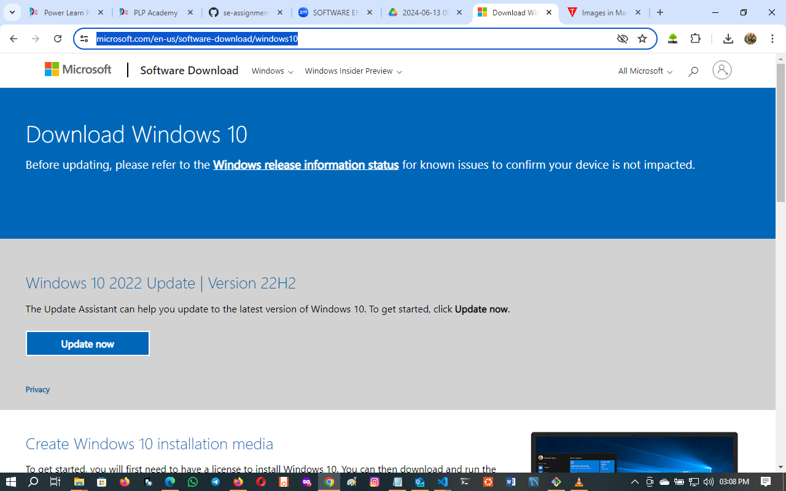

# Document detailing the setup process with step-by-step instructions

## Operating System (OS)
1. Prepare for Installation of Windows 10
    - 1.1 System Requirements
        - Processor: 1 GHz or faster compatible processor
        - RAM: 1 GB for 32-bit or 2 GB for 64-bit
        - Hard Disk Space: 16 GB for 32-bit OS or 20 GB for 64-bit OS
        - Graphics Card: DirectX 9 or later with WDDM 1.0 driver
        - Display: 800x600

    - 1.2 Backup Important Data
        - Backup all important files and data to an external drive or cloud storage.

2. Create a Bootable USB Drive
    - 2.1 Download Windows 10 ISO
        - Download the Windows 10 ISO file from the official Microsoft website.
        ```
        https://www.microsoft.com/en-us/software-download/windows10
        ```
        

2.2 Create Bootable USB
    - Use the Windows Media Creation Tool or a third-party tool like Rufus to create a bootable USB drive.
        Using Windows Media Creation Tool:
        Download the Media Creation Tool from the Microsoft website.
        Run the tool and select "Create installation media (USB flash drive, DVD, or ISO file) for another PC".
        Select the language, edition, and architecture (64-bit or 32-bit).
        Choose "USB flash drive" and follow the prompts to create the bootable USB drive.
        

3. Install Windows 10
    - 3.1 Boot from USB Drive
        - Insert the bootable USB drive into the computer.
        - Restart the computer and enter the BIOS/UEFI settings (commonly done by pressing a key like F2, F12, DEL, or ESC during startup).
        - Change the boot order to prioritize the USB drive.
        - Save changes and exit the BIOS/UEFI settings.
    - 3.2 Start Windows 10 Installation
        - The computer should boot from the USB drive and display the Windows Setup screen.
        - Select your language, time and currency format, and keyboard or input method, then click "Next".
        - Click "Install now".
    - 3.3 Enter Product Key
        - Enter your Windows 10 product key. If you don't have one, you can choose "I don't have a product key" and enter it later.
        - Select the Windows 10 edition you have a license for and click "Next".
    - 3.4 Accept License Terms
        - Read the license terms, check the box to accept them, and click "Next".
    - 3.5 Choose Installation Type
        - Select "Custom: Install Windows only (advanced)" to perform a clean installation.
    - 3.6 Select Partition
        - Choose the partition where you want to install Windows 10. If you're performing a clean installation, you can delete existing partitions and create a new one.
        - Select the partition and click "Next". The installation will begin.

4. Complete Installation
    - 4.1 Initial Setup
        - The computer will restart several times during the installation process.
        - Follow the on-screen instructions to set up your region, keyboard layout, and time zone.
    - 4.2 Connect to a Network
        - Connect to a Wi-Fi or Ethernet network to continue the setup.
    - 4.3 Set Up Account
        - Sign in with a Microsoft account or create a local account.
        - Set up a password and security questions.
    - 4.4 Privacy Settings
        - Choose your privacy settings for things like location, diagnostics, and tailored experiences.
    - 4.5 Finish Setup
        - Customize additional settings if prompted, or choose the default settings.
        - Windows will finalize the setup and bring you to the desktop.

5. Post-Installation Steps
    - 5.1 Install Updates
        - Go to Settings > Update & Security > Windows Update and check for updates. Install all available updates.
    - 5.2 Install Drivers
        - Install drivers for your hardware components. You can usually download these from the manufacturer's website.
    - 5.3 Install Essential Software
        - Install essential software and applications you need for daily use.
    - 5.4 Restore Data
        - Restore your backed-up data to your new Windows 10 installation.
        
## Conclusion
Following these steps should help you successfully install Windows 10 on your computer.